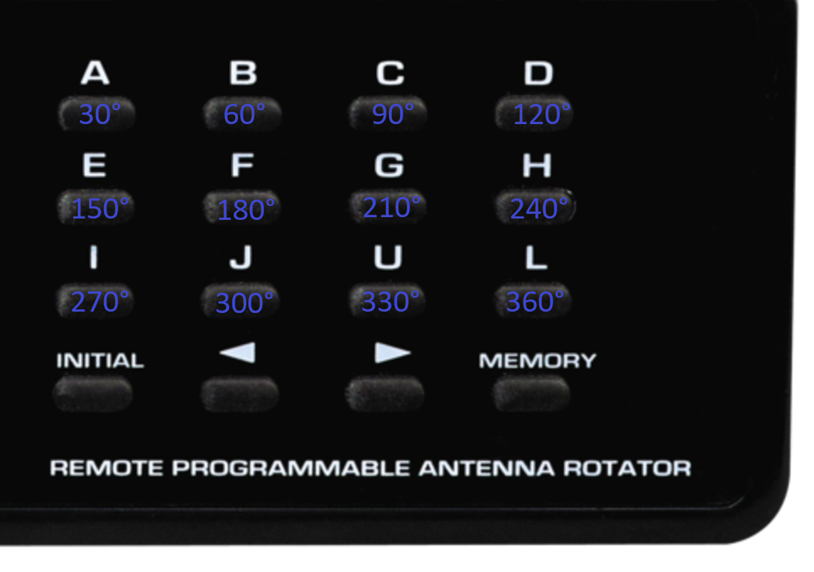

# Rotator Control v1.2 For Windows

> A simple Python application that enables PC remote control of the RCA VH226E antenna rotator when paired with a USB IR interface.
> Tested and working with an Iguanaworks USB IR Transceiver, which is no longer being sold. It **MIGHT** work with an IRDroid USB
> Infrared Transceiver, but I can't confirm this. Purchase one at your **OWN RISK**!

See my YouTube video for more information:

> **RCA VH226E Antenna Rotator: Adding PC Remote Control With a USB Infrared Transmitter and WinLIRC!**
> https://www.youtube.com/watch?v=61PsSciXil0

## Prerequisites

* **Python 3.x for Windows**
* **WinLIRC 0.9.0** 

## Software Setup

1. Install Python 3.x for Windows (either 32-bit or 64-bit is acceptable).
2. Download WinLIRC 0.9.0i and configure your IR transmitter/transceiver. 
3. **Important:** Ensure `transmit.exe` from your WinLIRC installation is placed in the exact same directory as the Python script.
4. Load the remote profile named `rca_vh226e_antenna_rotator` into WinLIRC.

> Inspect the `/images/` folder for screenshots of the WinLIRC configuration.

## Hardware Setup

1. Program each alphabetical preset key on the control box with the corresponding heading in degrees as follows:

## Usage

1. Launch WinLIRC and leave it running in the background.
2. Run the Python application.
3. Click the desired degree button in the GUI to rotate the antenna.
